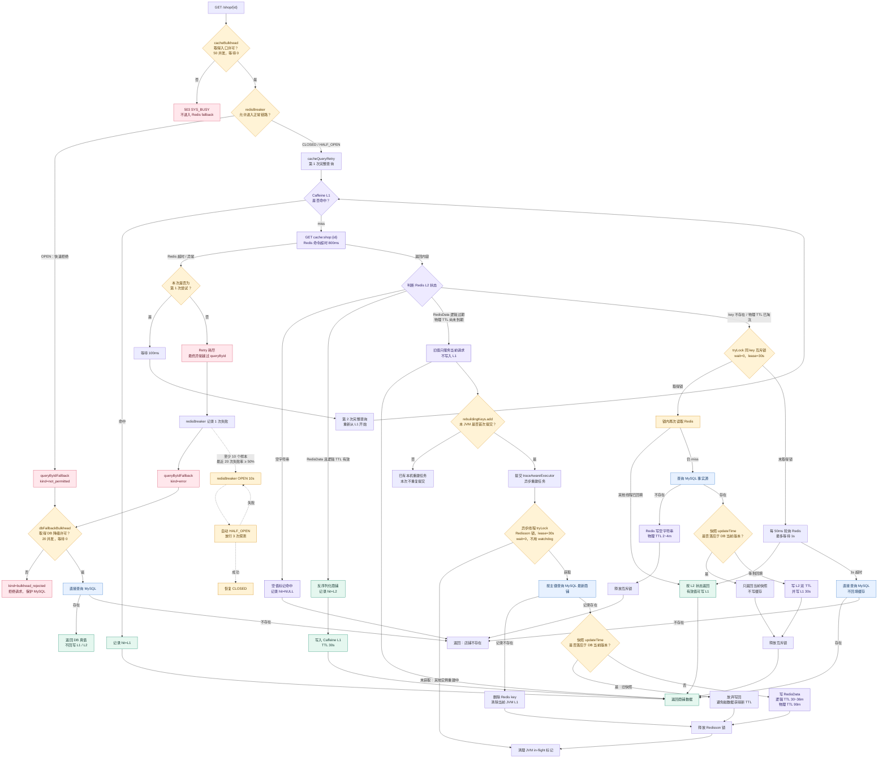
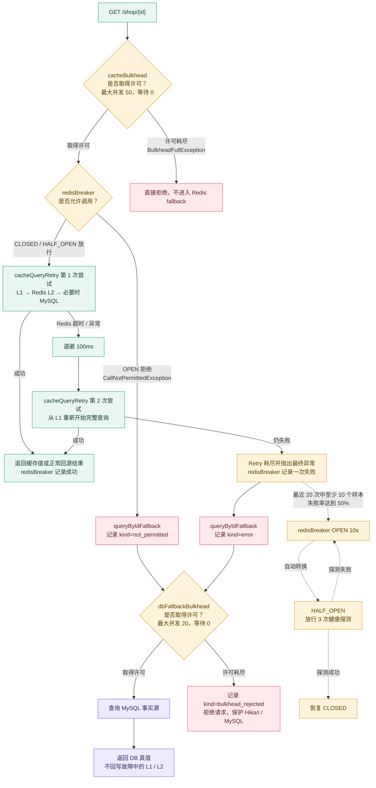

# 商铺多级缓存完整链路

> 配套可交互图：[商铺缓存读链路图](./shop-cache-read-chain.html)。建议先按“快速命中 → 过期重建 → 冷 miss → Redis 故障”四个导览讲图，再阅读下文的代码细节。

## 1. 设计目标与一致性契约

商铺详情是读多写少的展示数据，允许短暂旧读。本项目不追求 MySQL、Redis、各 JVM Caffeine 的强一致，而是用明确上界换取低延迟和较低复杂度：

- 正常更新：MySQL 提交后清当前实例 L1，并短重试删除 Redis。
- 其他实例 L1：不广播失效，最多由 30 秒 TTL 收敛。
- Redis 删除失败：旧值到逻辑 TTL 后由访问触发异步重建。
- 无访问或重建持续失败：Redis 物理 TTL 最终删除 key。
- 不做 Outbox，不做 RocketMQ/Redis Pub/Sub 广播；删除失败必须有指标和日志。

缓存只承载普通商铺展示信息，不用于券库存、活动状态、权限等不能接受长时间旧读的数据。

## 2. 读链路

入口为 `GET /shop/{id}`，调用 `ShopServiceImpl.queryById`，再进入 `MultiLevelCacheService.queryWithMultiLevelVersioned`：

```text
请求 → Caffeine L1 → Redis L2 → Redisson 同 key 互斥 → MySQL
```

### 2.0 完整读链路总图



总图阅读方式：先沿顶部看 L1/L2 正常命中；再从 `判断 Redis L2 状态` 分别向下看空值、逻辑过期和冷 miss；最后看 Redis 异常如何经过 Retry、CircuitBreaker、fallback 与 DB 舱壁。异步重建分支不会阻塞旧值返回，两条线是并行发生的。

### 2.1 L1 命中

Caffeine 最多 10,000 条，写后 30 秒过期。L1 只存确认逻辑有效的数据或冷加载得到的新数据。缓存对象按共享不可变引用使用，调用方不得原地修改。

### 2.2 L2 命中且逻辑有效

Redis value 是 `RedisData{data, expireTime}`。若 `expireTime > now`，将值写入 L1 并返回。

### 2.3 L2 命中但逻辑过期

当前请求允许返回旧值以保持低延迟，同时触发异步重建。旧值不再写入普通 30 秒 L1，因此 Redis 重建完成后，下一次请求能立即从 L2 取得新值。

重建使用两层去重：

1. JVM `rebuildingKeys` 在提交线程池前去重，避免同一实例为同 key 塞入大量无效任务。
2. 异步线程内获取 Redisson `lock:shop:{id}`，避免多个实例同时回源。

RLock 必须由异步执行线程自己获取和释放，不能由 HTTP 线程获取后跨线程释放。锁显式租期 30 秒，不使用 watchdog：商铺主键查询通常为毫秒级，极端情况下允许重复计算，优先保证锁占用有上界。

### 2.4 L1/L2 全 miss

请求尝试 Redisson 锁。持锁者双重检查 Redis，仍 miss 才查 MySQL并写回 L2/L1。未持锁者每 50ms 轮询一次，最多等待 1 秒；超时后自行查 MySQL，但不写缓存。这里用有限的重复 DB 读取换取请求线程不被无限挂起。

## 3. 双 TTL

L2 同时具有两种 TTL：

- 逻辑 TTL：30 分钟加 0～20% jitter，即约 30～36 分钟。
- 物理 TTL：固定 90 分钟，只在写入/重建时设置，普通读取不续期。

逻辑 TTL 负责“有流量时刷新”；物理 TTL 负责“即使无流量、应用宕机或重建持续失败，key 也最终消失”。它同时限制冷 key 的最长生命周期，并使商铺 key 能参与当前 Redis `volatile-lru` 淘汰。物理 TTL 必须长于逻辑 TTL，否则逻辑过期时已经没有旧值可供 stale-while-revalidate。

## 4. 缓存穿透

MySQL 查询不存在时，Redis 写空字符串，TTL 为 2～4 分钟。相同无效 ID 后续命中空值，不再查 DB。它不能阻止大量不同无效 ID 各穿透一次；若该风险上升，再考虑布隆过滤器、合法 ID 集合和入口限流。

## 5. 缓存击穿

有旧值时用逻辑过期：先返回旧值，再异步重建。完全 miss 时用 Redisson 同 key 互斥、锁内双检和 1 秒有界等待。JVM in-flight 解决线程池任务风暴，Redisson 解决跨实例重复回源，两者职责不同。

## 6. 缓存雪崩与冷启动

TTL jitter 分散不同 key 的逻辑过期时间；逻辑过期避免热点请求同步打 DB；互斥锁限制同 key 回源；物理 TTL 防止失效 key 永久占用内存。

冷启动分三类：

- JVM 冷启动：L1 为空、Redis 仍有值，首次请求从 L2 回填 L1。
- 单 key 冷启动：L1/L2 都为空，由 Redisson 互斥回源。
- Redis 整体冷启动：大量不同 key 同时 miss；同 key 锁无法限制不同 key 的总 DB 压力。生产化时应增加热点预热和全局回源舱壁，本项目如实保留这一边界。

## 7. 更新与 Cache-Aside

`PUT /shop` 在 MySQL 事务中更新商铺。只有提交成功后，`afterCommit` 才执行缓存失效：清当前 JVM L1、删除 Redis L2。Redis 删除最多短重试两次（100ms、200ms退避）；瞬时失败后成功记一次 `hmdp.cache.evict{result=ok}`，重试耗尽记 `result=error` 并输出错误日志。

不把 Redis 删除放进 MySQL 事务：普通 `@Transactional` 无法让两个资源原子提交，而且提交前删除会允许普通 MVCC 快照读取得旧 DB 数据并在提交后回填旧缓存，同时 Redis 故障会让所有商铺更新不可用。

本项目决定不做 Outbox。代价是删除持续失败后，旧 L2 最多维持到剩余逻辑 TTL；极端情况下由剩余物理 TTL 淘汰。这个取舍只适用于允许最终一致的商铺展示数据。

## 8. 多实例一致性

更新实例会清自己的 L1 和共享 L2，但其他实例的 L1 不会收到通知，最多继续旧读 30 秒。本项目不做 RocketMQ 广播或 Redis Pub/Sub，因为写入很少、旧读可接受，广播消费、离线实例和消息可靠性会增加超出收益的复杂度。

## 9. Redis 宕机

这里不是简单地 `catch RedisException → 查 MySQL`，而是由 Resilience4j 组成一条有边界的容错链：



图里的实线是单次请求的执行路径，虚线是熔断器跨请求积累样本和状态迁移的过程。需要特别区分：Retry 的两次 Redis 尝试发生在一个 HTTP 请求内部；`redisBreaker` 位于外层，只接收 Retry 最终返回的一个成功或失败结果。

```text
HTTP 查询
  → cacheBulkhead（Controller 入口舱壁：最多 50 个并发）
    → redisBreaker（Service 熔断：判断是否允许进入正常链路）
      → cacheQueryRetry（只读重试：首次 + 1 次重试）
        → L1 → Redis L2 → 必要时 MySQL 回源
  → queryByIdFallback（真实异常或熔断拒绝）
    → dbFallbackBulkhead（降级舱壁：最多 20 个并发）
      → MySQL → 返回 DB 真值，不回写故障中的缓存
```

`cacheBulkhead` 在 `ShopController.queryShopById`，`redisBreaker` 在 `ShopServiceImpl.queryById`，
`cacheQueryRetry` 在 `MultiLevelCacheService`。三个独立 Bean 的调用边界明确固定为
“入口舱壁 → Redis 熔断 → 重试”，不依赖同一方法上多个 Resilience4j 注解的默认切面顺序。
只有内层两次缓存尝试都失败，异常才会越过 `queryById`，由 `redisBreaker` 记录为一次失败并进入 fallback。

### 9.1 超时是整条容错链的前提

Lettuce Redis 命令超时从默认的长等待收敛到 800ms。舱壁只能拒绝后来者，不能释放已经卡在 Redis I/O 上的线程；如果没有短超时，即使有熔断和舱壁，前 50 个请求仍可能长时间占住 Tomcat 线程。因此顺序上先有“失败快速返回”，后面的重试、熔断和降级才有意义。

### 9.2 Retry：只重试幂等读，而且只重试一次

`MultiLevelCacheService.queryWithMultiLevelVersioned` 使用 `@Retry(name = "cacheQueryRetry")`：

- `max-attempts: 2` 表示总共两次尝试，即首次调用失败后只重试一次，不是额外重试两次。
- 首次等待 100ms，开启指数退避，乘数为 2；当前只有一次重试，所以本链路实际只发生一次 100ms 退避。
- 重试覆盖整次多级缓存查询。第二次会重新从 L1 开始，因此第一次失败后若其他请求已经把 L1/L2 修复，第二次可以直接命中。
- 只读查询具备幂等性，可以安全重试；商铺更新、领券等写路径不使用该 Retry，避免重复副作用。

不把 Retry 和 fallback 放到同一层：fallback 会把异常转换成正常 `Result`，如果它位于 Retry 内部，Retry 看不到异常，也就不会执行。现在是两次尝试都失败后才把最终异常交给外层熔断和降级。

### 9.3 CircuitBreaker：学习故障并在打开后快速失败

`redisBreaker` 只代表 Redis 依赖，不与 MQ、MySQL 共用熔断器，避免 Redis 抖动错误地熔断其他健康通道。配置为：

- COUNT_BASED 滑动窗口记录最近 20 次外层查询结果。
- 至少收集 10 次调用才开始计算，避免冷启动阶段一两次失败就误熔断。
- 失败率达到 50% 时从 CLOSED 切到 OPEN。
- OPEN 保持 10 秒，期间新请求不再访问正常缓存链路，而是抛出 `CallNotPermittedException` 并直接进入 fallback。
- 10 秒后自动进入 HALF_OPEN，最多放行 3 次探测；健康探测成功后恢复 CLOSED，失败则重新 OPEN。
- `BusinessException` 和 `BulkheadFullException` 不计入 Redis 失败率；后者保留用于其他共用 `redisBreaker` 的链路防御。店铺入口舱壁位于熔断器外，不会进入其统计窗口。

需要注意计数口径：Retry 位于 `MultiLevelCacheService` 的内层代理，`redisBreaker` 位于 `ShopServiceImpl` 外层，所以一次 HTTP 请求即使内部访问 Redis 两次，熔断器看到的仍是最终的一次成功或失败；不会把一次 HTTP 请求重复计算成两个熔断样本。

### 9.4 Fallback：两类原因，同一个只读降级语义

`queryByIdFallback(Long id, Throwable t)` 有两个正常的触发来源：

1. CLOSED 学习期或 HALF_OPEN 探测期间，缓存查询在重试耗尽后仍抛出真实异常，记录 `kind=error`。
2. 熔断器处于 OPEN，新请求被快速拒绝，异常为 `CallNotPermittedException`，记录 `kind=not_permitted`。

这两种情况都允许降级查询 MySQL，因为商铺详情是只读展示数据，DB 是事实源。降级结果直接返回当前请求，但不写 L1/L2：故障期回写会再次依赖 Redis，也可能让大量降级请求同时争抢写缓存。

入口 `cacheBulkhead` 位于 Controller 外层；许可耗尽时直接由全局异常处理器返回 503，
不会进入 `redisBreaker` 或本 fallback。`bulkhead_rejected` 只用于记录 DB 降级舱壁满载。

### 9.5 Bulkhead：正常链路和降级链路分别隔离

本链路使用两个信号量舱壁，`max-wait-duration` 都是 0，拿不到许可立即失败，不在应用内排队：


| 舱壁                 | 位置                 | 并发许可 | 作用                                                                |
| ---------------------- | ---------------------- | ---------: | --------------------------------------------------------------------- |
| `cacheBulkhead`      | `ShopController.queryShopById` |       50 | 最外层限制请求容量，拒绝不进入 Redis fallback                     |
| `dbFallbackBulkhead` | Redis fallback 内    |       20 | 限制故障期直接回源 MySQL 的请求，许可数与 Hikari 最大连接池 20 对齐 |

`dbFallbackBulkhead` 采用 `BulkheadRegistry` 手动执行 `tryAcquirePermission()` / `releasePermission()`，不是在 fallback 方法上添加 `@Bulkhead`。原因是 Resilience4j 的 `fallbackMethod` 由切面反射调用，不会再次经过 Spring AOP 代理，写在 fallback 私有方法上的注解不会生效。许可必须在 `finally` 中释放；许可耗尽时宁可拒绝请求，也不让“降级”本身打穿数据库。

这里选择信号量舱壁而不是线程池舱壁，因为商铺查询是同步 HTTP 调用：不需要为了隔离再切换线程、传播上下文和维护额外队列。信号量能直接给并发设置硬上限，配合 Redis 800ms 超时控制占用时长。

### 9.6 故障期间与恢复后的完整行为

```text
Redis 短暂抖动
  → 首次缓存读取失败
  → 100ms 后重试一次
  → 重试成功：正常返回，熔断器记成功，不走 fallback

Redis 持续故障、熔断尚未打开
  → 两次尝试都失败
  → redisBreaker 记一次失败
  → fallback 取得 DB 舱壁许可后查询 MySQL

失败样本达到阈值
  → redisBreaker OPEN
  → 后续请求不再等待 Redis 800ms，也不再执行 Retry
  → 直接 fallback；DB 舱壁最多放行 20 个并发

打开 10 秒后
  → 自动 HALF_OPEN，放行 3 次正常缓存链路探测
  → 探测成功则 CLOSED；失败则重新 OPEN
```

Redis 恢复后，新进入正常链路的请求继续按 L1/L2/DB 规则工作。若更新期间删除 Redis 失败并遗留旧 L2，则仍由逻辑 TTL 触发重建、物理 TTL 最终淘汰。Resilience4j 解决的是依赖故障时的可用性和爆炸半径，不替代缓存一致性协议。

实现注意：`queryByIdFallback` 保持 `public`，因为 Resilience4j 1.7.1 的 `FallbackMethod` 通过反射调用 fallback；设为 `private` 在高并发下可能触发 `IllegalAccessException`，并被包装成 HTTP 500。

可观测性方面，`ResilienceMetrics` 订阅熔断错误、熔断拒绝、状态迁移和 Retry 事件；fallback 记录 `error`、`not_permitted`，DB 降级舱壁满载时记录 `bulkhead_rejected`。入口舱壁拒绝由 Resilience4j 原生 bulkhead 指标与全局 503 日志观测。

## 10. 写回版本核验

冷加载和异步重建写 Redis 前，将查询快照的 `updateTime` 与数据库当前版本比较；快照落后则放弃写回，避免旧快照获得新的逻辑和物理 TTL。比较与写 Redis 之间仍有极小竞态，属于最终一致性边界；若将来要求更强，可改为单调递增 version 字段。
