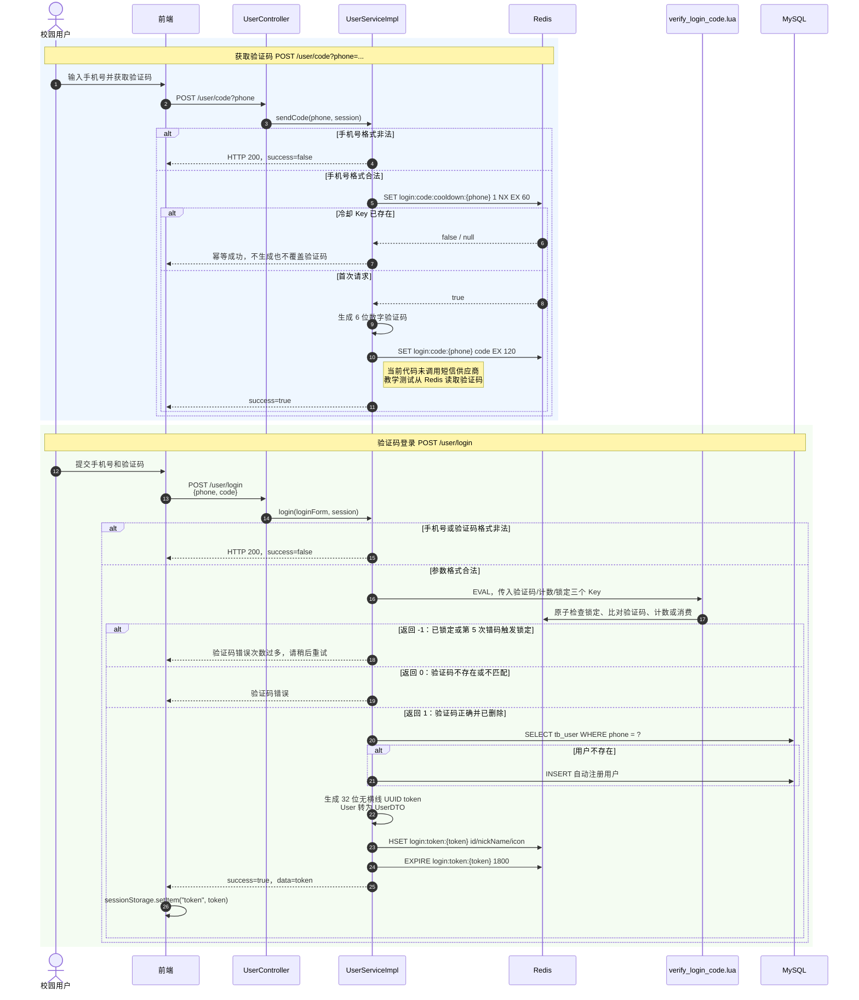
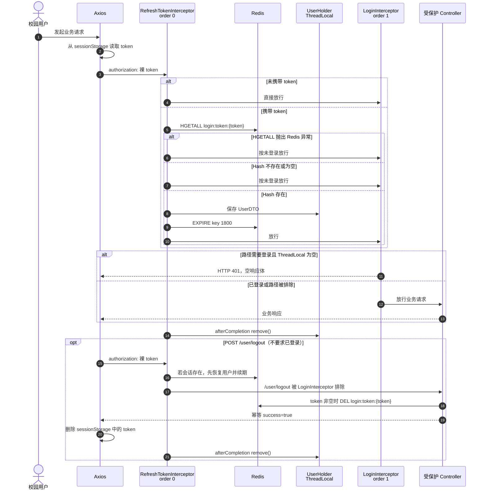
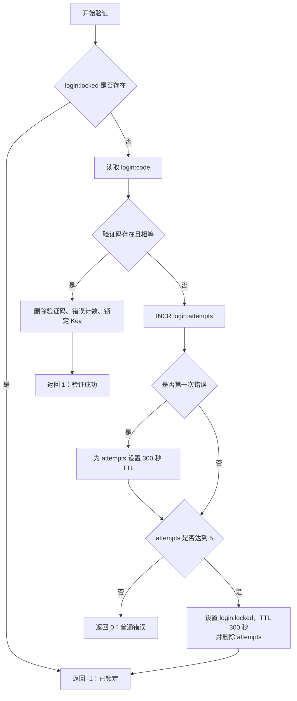
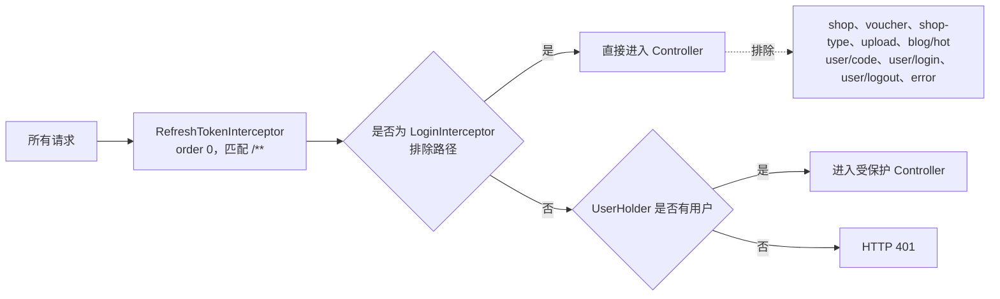

# 登录全链路（按当前代码查证）

> 查证范围：前端登录页与 Axios 拦截器、`UserController`、`UserServiceImpl`、两个登录拦截器、`verify_login_code.lua`、Redis 常量及登录接口测试。本文描述的是仓库当前实现，而不是理想设计。

## 一张图讲清主链路

## 携带登录态访问与登出

## Lua 验证码状态机

这里必须使用 Lua，而不能在 Java 中先 `GET` 再 `DEL`：后者不是原子操作，并发请求可能同时读到正确验证码并各自登录成功。当前脚本把锁定检查、验证码比较、错码计数、临时锁定和成功消费放在 Redis 的一次原子执行中。

错误计数窗口从**第一次错码**开始固定为 5 分钟，并不会随每次错码滑动续期。验证码格式不合法时在 Java 层直接返回，不进入 Lua，也不增加错误次数。

## Redis 数据模型

| Key | 类型 | 生命周期 | 写入/删除时机 | 用途 |
| --- | --- | --- | --- | --- |
| `login:code:cooldown:{phone}` | String | 60 秒 | 首次发码前 `SET NX EX` | 重复发码幂等冷却 |
| `login:code:{phone}` | String | 2 分钟 | 发码写入；正确登录时 Lua 删除 | 保存最新验证码 |
| `login:attempts:{phone}` | String 计数 | 首次错码起 5 分钟 | 错码 `INCR`；成功或触发锁定时删除 | 统计连续错码 |
| `login:locked:{phone}` | String | 5 分钟 | 第 5 次错码写入 | 临时拒绝验证码校验 |
| `login:token:{token}` | Hash | 30 分钟滑动 TTL | 登录写入；有效请求续期；登出删除 | 多实例共享的服务端会话 |

Token Hash 只保存 `UserDTO` 的非空字段，即 `id`、`nickName`、`icon`；不保存手机号和密码。前后端约定 `authorization` 头直接放裸 token，`Bearer {token}` 会被当成 token 本体的一部分，因此查不到 Redis Key 并返回 401。

## 拦截器覆盖关系

注意：所谓“公开路径”只是绕过 `LoginInterceptor`，仍然会先经过 `RefreshTokenInterceptor`。因此公开请求若携带有效 token，也会恢复用户上下文并刷新 TTL。

## 查证结论与实现边界

- 已确认：发码冷却、6 位验证码、2 分钟验证码 TTL、Lua 单次消费、5 次错码锁 5 分钟、自动注册、32 位 token、30 分钟滑动会话、401 鉴权和幂等登出，均与当前代码一致。
- 当前“发验证码”只生成并写入 Redis，没有短信供应商调用；接口成功不代表手机实际收到短信。
- `HttpSession` 参数仍保留在 Controller/Service 签名中，但登录链路没有读写 Session，实际登录态完全由 Redis token Hash 承担。
- Redis 降级范围有限：仅 `HGETALL` 会话读取异常被捕获并转成后续 401；`EXPIRE` 续期、发码、Lua、建会话和登出时的 Redis 异常并未在这段代码中降级，可能进入全局异常处理，不能概括为“Redis 异常一律返回 401”。
- 冷却 Key 与验证码写入不是原子操作。若冷却写入成功而验证码写入失败，接下来 60 秒内重试会幂等成功但仍没有验证码。
- 正确登录会消费验证码，却不会删除冷却 Key；如果用户登录后立即退出并在原 60 秒冷却期内再次发码，也会收到幂等成功但 Redis 中没有可用验证码。这是当前实现的真实边界。
- 发码冷却只限制单手机号的 60 秒重复请求，不是完整防刷；生产环境还需要手机号、IP、设备等维度的长窗口限流。
- 同一手机号每次成功登录都会生成新 token，旧 token 不会自动失效；当前实现允许多端/多会话并存。

## 代码证据索引

| 结论 | 代码位置 |
| --- | --- |
| 接口定义 | `src/main/java/com/hmdp/controller/UserController.java` |
| 发码、登录、自动注册、会话写入、登出 | `src/main/java/com/hmdp/service/impl/UserServiceImpl.java` |
| Redis Key 与 TTL | `src/main/java/com/hmdp/utils/RedisConstants.java` |
| 原子验证码校验与锁定 | `src/main/resources/verify_login_code.lua` |
| 拦截器注册、顺序与公开路径 | `src/main/java/com/hmdp/config/MvcConfig.java` |
| token 恢复、续期与 ThreadLocal 清理 | `src/main/java/com/hmdp/utils/RefreshTokenInterceptor.java` |
| 未登录返回 401 | `src/main/java/com/hmdp/utils/LoginInterceptor.java` |
| 前端保存 token、注入裸 authorization 头 | `hm-dianping-frontend/html/hmdp/login.html`、`hm-dianping-frontend/html/hmdp/js/common.js` |
| 接口行为回归测试 | `autotest/testcases/test_login_chain.py` |

## 面试时一句话说明

登录态放 Redis 不只是为了“快”，更重要的是让多个应用实例共享会话，并天然支持 TTL、滑动续期、主动登出和水平扩容；`UserHolder` 的 ThreadLocal 只保存单次请求上下文，绝不是登录态存储。
