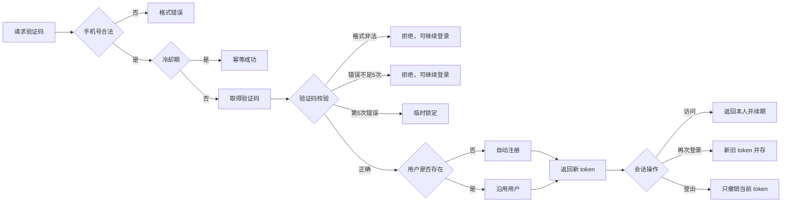

# 登录链路自动化接口测试设计

## 测试目标

证明四件事：接口边界正确、安全状态机正确、会话生命周期正确、依赖故障时错误语义可控。

本套件全部使用 pytest 发送 HTTP 请求，不启动浏览器，不操作页面和 DOM，不包含 UI 自动化。完整业务流程见 [01-login-chain.md](./01-login-chain.md)。

## 测试 seam

- HTTP 是唯一业务断言边界：`/user/code`、`/user/login`、`/user/logout`、`/user/me`。
- Redis 只作为测试夹具：读取教学环境验证码、缩短 TTL、注入会话失效和依赖故障；业务是否成功仍以 HTTP 结果为主。
- MySQL 只作为自动注册场景的灰盒补充检查点，不直接调用 Java 私有实现。
- 不 Mock Redis/MySQL，不测试私有方法，不依赖前端。

## 29 条用例的分层

| 分组 | 数量 | 重点 |
| --- | ---: | --- |
| 发码 S01～S06 | 6 | 缺参、格式边界、重复请求幂等、冷却 TTL |
| 登录基础 L01～L12（无 L08） | 11 | 错码、过期、自动注册、一次性消费、会话 TTL |
| 会话与故障 L13～L18 | 6 | 缺失/伪造 token、登出、Bearer 契约、锁定、Redis 故障 |
| 补充分支 L19～L24 | 6 | 错误恢复、并发消费、重复登录、会话隔离、无 token 登出 |

完整用例与实现一一对应，见 `autotest/testcases/test_login_chain.py`。

## 流程分析法

以“成功获取验证码并登录”为基本流，每条用例只引入一个关键分支：

## 自动化接口用例清单

| ID | 类型 | 接口场景 | 主要步骤 | HTTP 预期 |
| --- | --- | --- | --- | --- |
| S01 | 黑盒 | 发码缺少手机号 | 不传 `phone` 请求发码 | HTTP 400 |
| S02 | 黑盒 | 空值和字母手机号 | 分别传空串、纯字母 | HTTP 200，手机号格式错误 |
| S03 | 黑盒 | 手机号长度边界 | 分别传 10 位、12 位数字 | HTTP 200，手机号格式错误 |
| S04 | 黑盒 | 国际区号 | 传 `+86` 前缀手机号 | HTTP 200，手机号格式错误 |
| S05 | 灰盒接口 | 冷却期重复发码仍可登录 | 获取验证码后再次发码，再用原码登录 | 重复发码成功，原码登录成功 |
| S06 | 灰盒接口 | 冷却期多次重复发码 | 60 秒内连续发码 4 次 | 全部幂等成功，验证码不变 |
| L01 | 黑盒 | 登录缺少手机号 | 只提交验证码 | HTTP 200，手机号格式错误 |
| L02 | 黑盒 | 登录手机号长度边界 | 分别使用 10 位、12 位手机号 | HTTP 200，手机号格式错误 |
| L03 | 黑盒 | 登录手机号带国际区号 | 使用 `+86` 前缀 | HTTP 200，手机号格式错误 |
| L04 | 黑盒 | 未发码直接登录 | 合法手机号提交任意 6 位码 | HTTP 200，验证码错误 |
| L05 | 黑盒 | 验证码不匹配 | 获取验证码后提交另一组 6 位码 | HTTP 200，验证码错误 |
| L06 | 黑盒 | 验证码格式非法 | 获取验证码后提交 5 位码 | HTTP 200，验证码错误 |
| L07 | 灰盒接口 | 验证码过期 | 缩短验证码 TTL，过期后登录 | HTTP 200，验证码错误 |
| L09 | 灰盒接口 | 正常登录与本人查询 | 正确登录，再请求 `/user/me` | 返回 32 位 token；本人查询成功 |
| L10 | 灰盒接口 | 新手机号自动注册 | 使用未注册手机号登录 | 登录成功，用户只创建一次 |
| L11 | 黑盒 | 验证码不可重复使用 | 同一验证码连续登录两次 | 第一次成功，第二次验证码错误 |
| L12 | 灰盒接口 | 活跃会话续期 | 缩短 token TTL 后请求 `/user/me` | HTTP 200，会话恢复约 30 分钟 |
| L13 | 黑盒 | 未携带 token | 直接请求 `/user/me` | HTTP 401，空响应体 |
| L14 | 黑盒 | 伪造 token | 携带不存在的 token 请求本人信息 | HTTP 401 |
| L15 | 黑盒 | 正常与重复登出 | 登录后登出、访问本人、再次登出 | 登出成功；旧 token 401；重复登出成功 |
| L16 | 黑盒 | 错误的 Bearer 契约 | 使用 `Bearer {token}` 请求本人信息 | HTTP 401 |
| L17 | 黑盒 | 连续错码锁定 | 连错 5 次后提交正确验证码 | 返回错误次数过多 |
| L18 | 故障接口 | Redis 超时鉴权 | 注入 Redis 暂停后请求本人信息 | HTTP 401，不返回 500 |
| L19 | 黑盒 | 格式错误后恢复 | 先提交 5 位码，再提交正确码 | 前者失败，后者登录成功 |
| L20 | 黑盒 | 未达上限错码后恢复 | 连错 4 次，再提交正确码 | 4 次均失败，随后登录成功 |
| L21 | 并发接口 | 同码并发登录 | 两个独立 HTTP 客户端同时提交正确码 | 恰好一个成功、一个验证码错误 |
| L22 | 黑盒 | 已登录再次登录 | 同手机号完成两次验证码登录 | 返回不同 token；新旧 token 都能查询同一用户 |
| L23 | 黑盒 | 多会话登出隔离 | 创建两个 token，只退出第二个 | 第二个 token 401，第一个仍为 200 |
| L24 | 黑盒 | 无 token 登出 | 不携带请求头调用退出 | HTTP 200，幂等成功 |

说明：S05、S06、L07、L09、L10、L12、L18 使用了 Redis/MySQL 辅助夹具，但执行入口和用户可见结论仍然来自 HTTP 接口，因此它们属于灰盒接口测试，不是 UI 测试或 Java 白盒单测。

## 最值得讲的测试手法

### 1. 状态注入代替长时间等待

- 验证码过期：把验证码 TTL 改为 1 秒，再用 `wait_until` 等 key 消失。
- 会话续期：先把 token TTL 改为 60 秒，访问一次后断言恢复到约 1800 秒。
- 会话失效：直接删除 token key，再验证受保护接口返回 401。

这样验证的是同一个状态转换，却不用真的等 2 分钟或 30 分钟。

### 2. 最终状态轮询代替固定 sleep

测试使用 `wait_until(predicate, timeout, interval)` 等真实条件成立。超时错误会保留最后一次观察结果，既降低 flaky，也更容易定位。

### 3. 故障注入验证降级

用 `CLIENT PAUSE 2000 ALL` 确定性阻塞 Redis，再访问需要鉴权的接口。应用 Redis 超时为 800ms，期望最终得到 401 而非 500。这里验证的不只是状态码，还验证超时、异常捕获和两层拦截器组合后的整体行为。

### 4. 跨存储断言

成功登录同时检查 HTTP token、Redis token hash 和 `/user/me`；自动注册同时检查 HTTP 与 MySQL 行数。多个观察点共同证明链路闭合，但测试不依赖 Java 私有实现。L19～L24 则只用 HTTP 结果证明用户可见行为。

### 5. 并发请求使用独立客户端

L21 使用两个独立 `ApiClient` 并发提交同一验证码，避免多个线程共享同一个 `requests.Session`。断言只看两个登录响应：必须恰好一个成功，另一个失败。

## 可重复性设计

- `phone_pool` 给用例分配独立合法手机号。
- `sms_code` 在发码前清理该手机号的频控、错误计数和锁定键。
- 自动注册用例前后清理自己的用户数据。
- 并发登录使用独立客户端，并在用例结束后关闭连接。
- 故障用例标记 `slow/serial/chaos`，禁止与其他共享 Redis 的流量并行。

## 测试结果怎么看

不要只说“有 29 条用例”。应说：用例覆盖参数等价类和边界值、安全状态迁移、验证码并发单次消费、重复登录与多会话隔离、会话生命周期和依赖故障；并且用状态注入和条件轮询保证确定性。

当前校验状态：pytest 已成功收集 29 条用例；新增用例需要在应用、Redis、MySQL 启动后完成环境实跑，不能在实跑前宣称 29/29 通过。
