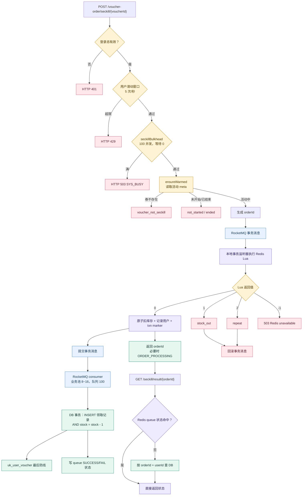
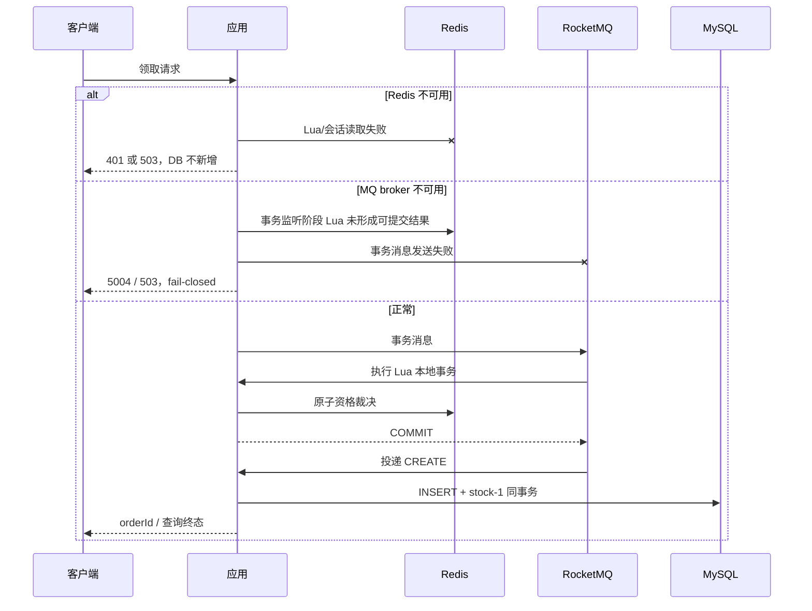

# 限时领券完整链路

## 1. 一致性目标

入口追求的是高并发下“不超卖、一人一券、故障时宁可少发也不多发”。Redis 是高并发资格裁决层，MySQL 是最终事实源。最终对账采用精确等式：

```text
tb_seckill_voucher.stock = initial_stock - COUNT(tb_voucher_order)
COUNT(tb_voucher_order) = COUNT(DISTINCT user_id)
```

Redis 预扣成功不等于领取记录已经落库；HTTP 返回 orderId 后，消费者仍需异步提交数据库事务。结果查询接口用排队状态表达 WAITING、SUCCESS 和失败终态。

## 2. 主链路总图



## 3. 活动窗口与预热

`SeckillWarmUpServiceImpl.ensureWarmed` 读取 `seckill:meta:{voucherId}`。缓存不存在时查询秒杀券并写入 begin/end。活动开始前允许从 DB 初始化 Redis 库存；活动已经开始而库存 key 缺失时拒绝从 DB 回填，因为数据库库存可能落后于已经发生的 Redis 预扣，贸然回填会制造额外库存。

因此活动中丢失 `seckill:stock:*` 的语义是 fail-closed：返回库存不足或不可领取，宁可少发，不用落后 DB 值恢复。压测准备脚本必须显式完成库存预热。

## 4. Lua 原子资格裁决

FULL 档使用 `seckill.lua` 在一次 Redis 执行中完成库存判断、库存扣减、一人一券记录和事务 marker。结果为 0/1/2/-1，分别表示成功、库存不足、重复领取和系统异常。

测试开关 `seckill:test:protection` 支持 FULL、LEGACY、EARLY。EARLY 档故意只扣库存、不做 Redis 一人一券，用来证明数据库唯一索引仍能阻止重复记录，但 Redis 可能多扣，最终需要活动后对账重算。

## 5. 为什么使用 RocketMQ 事务消息

普通“先扣 Redis、再发消息”在进程崩溃窗口可能只扣库存不落消息；普通“先发消息、再扣 Redis”又可能让无资格消息被消费。事务消息把 Redis Lua 放入本地事务监听阶段：Lua 成功才 COMMIT，库存不足或重复则 ROLLBACK，异常由 broker 回查事务 marker。

入口仍是同步等待事务消息发送结果，因此 MQ broker 延迟会进入 HTTP 延迟。发送通道由独立 `mqBreaker` 隔离；失败返回业务码 5004，不错误地污染 `redisBreaker`。

## 6. 消费端与数据库事实源

消费者使用独立线程池 core=8、max=16、queue=100。消息处理在一个数据库事务中先插入领取记录，再执行 `stock = stock - 1 WHERE stock > 0`；扣减失败则整个事务回滚。主键保证同一 orderId 重投幂等，`uk_user_voucher(user_id, voucher_id)` 是一人一券的最后防线。

线程池或 DB 故障时整批消息 `RECONSUME_LATER`，最多重试 5 次，随后进入死信；定时对账负责补消息或按 DB 领取账重算活动后库存。

## 7. 结果查询

入口拿到 Lua 成功时先写 queue WAITING，再返回 orderId。结果查询优先读 Redis queue，避免高峰轮询直接打 DB；queue 缺失时才按 orderId 与当前 userId 查询数据库。结果查询独立使用 10 次/秒限额，不与提交的 5 次/秒配额互相消耗。

## 8. 故障语义



Redis 全下线时登录态也存于 Redis，拦截器可能先返回 401；测试不把它误说成业务限流 fail-open。MQ 下线和 Redis 库存缺失均坚持 fail-closed，并以 DB 零新增作为主证据。

## 9. 可观测性与容量边界

关键指标包括 `hmdp_seckill_result_total{reason}`、`hmdp_seckill_latency_seconds`、`hmdp_order_consume_total`、Resilience4j breaker/bulkhead 指标以及对账计数。指标是辅助证据，最终正确性仍由 DB 和 Redis 四方对账确认。

本机从 100 线程提升到 500 线程时，吞吐仍停留在约 630~650 req/s，而平均延迟从 141ms 升至 759ms。500/629≈0.795s，与实测相近，说明新增并发主要进入等待；当前 100 并发业务舱壁、Tomcat 线程、同步事务消息和同机资源共同形成容量拐点。

